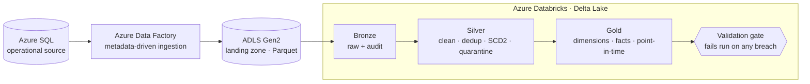
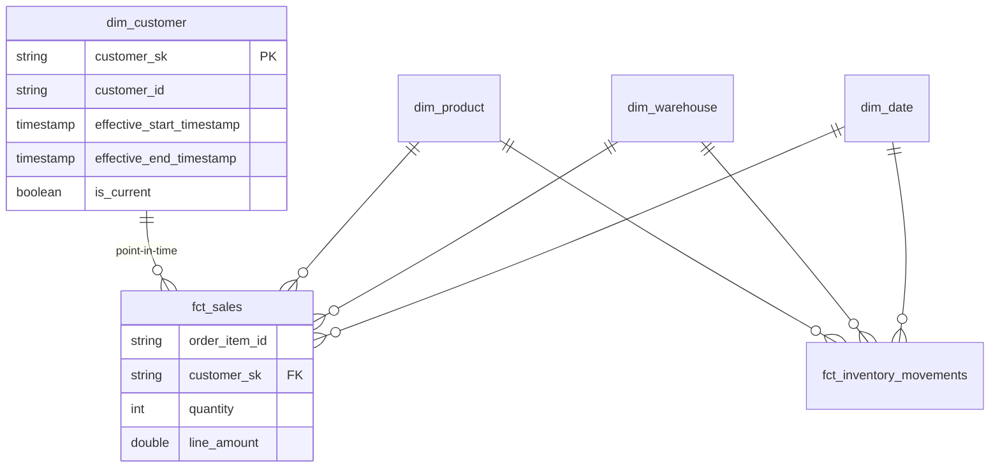
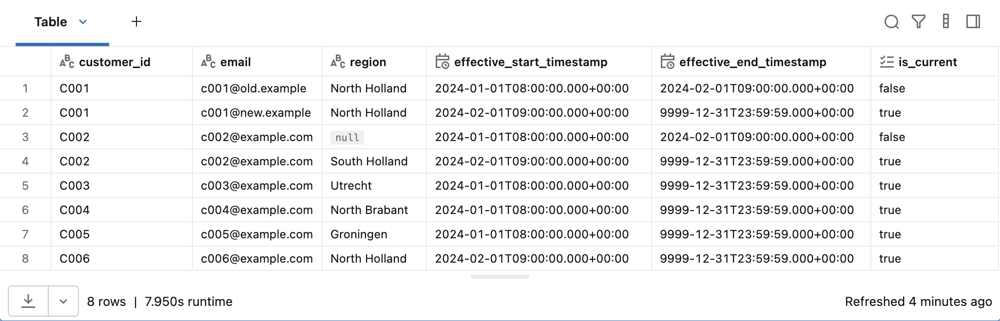
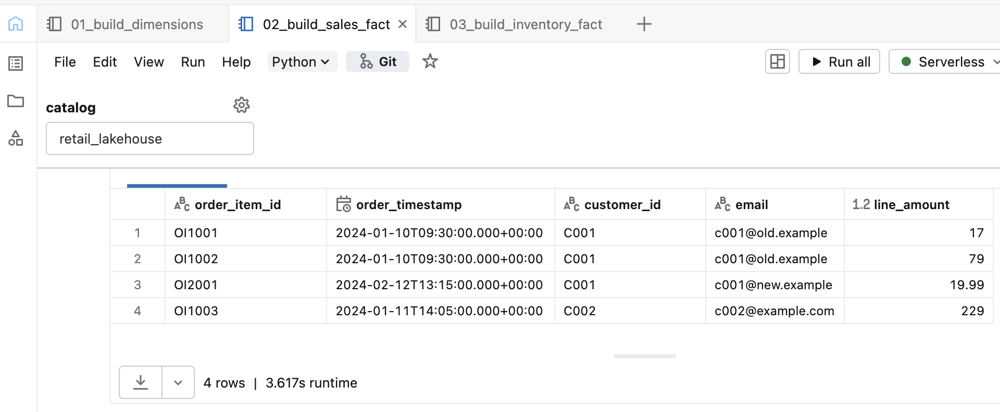
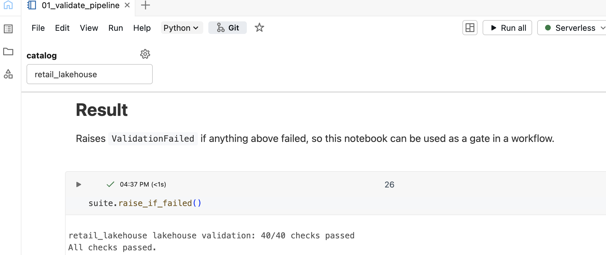
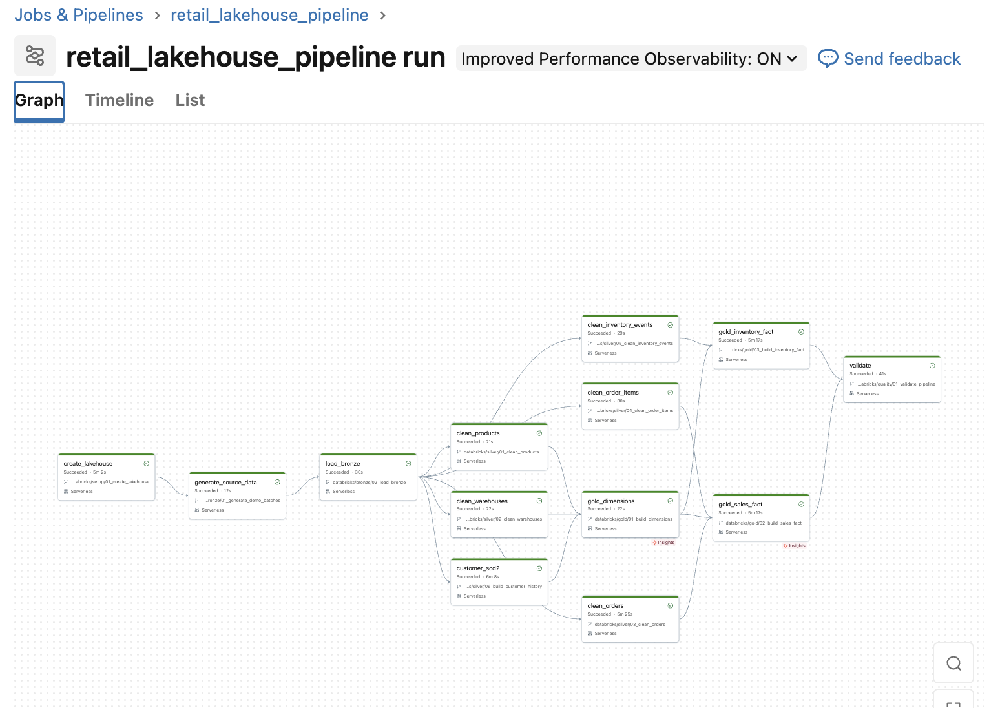
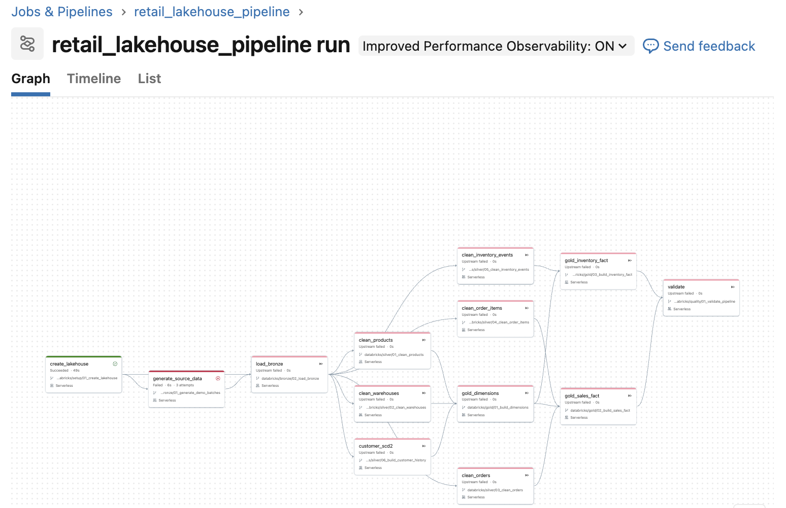

# Azure Retail & Supply Chain Lakehouse

An Azure-ready data platform for a multi-warehouse e-commerce retailer. It ingests
operational data through **Azure Data Factory** into **ADLS Gen2**, then transforms
it into governed, analytics-ready **Delta Lake** models on **Databricks** using a
Medallion (Bronze → Silver → Gold) architecture.

The pipeline preserves customer history for point-in-time analysis, produces
consistent sales and inventory facts, and enforces data quality with an executable
validation gate that fails the run rather than publishing bad data.


## What this project does

A multi-warehouse retailer holds operational data across several systems: a
customer master that changes over time, a product catalog, warehouse locations,
order headers and line items, and a stream of inventory movements. Reporting
directly against those systems is slow, couples analytics to transactional load,
and gives no reliable view of history — for example, *what a customer's region was
at the time an order was placed*.

This platform solves that with a governed lakehouse:

- **Metadata-driven ingestion** — one parameterized Azure Data Factory pipeline
  serves all six entities from a control table, choosing full or watermark-based
  incremental loading per entity.
- **Slowly Changing Dimension (Type 2)** — customer history is preserved with a
  two-stage expire-and-insert and null-safe change detection.
- **Point-in-time dimensional joins** — each order joins to the customer version
  in effect *at order time*, so history is accurate and facts never fan out.
- **Data quality by construction** — deduplication, quarantine with reasons,
  referential-integrity and business-rule checks, gated by an executable
  validation task.
- **Dependency-aware orchestration** — a Databricks multi-task Workflow with
  retries, upstream-failure propagation, and idempotent reruns.

## Architecture



The Databricks core (Bronze → Gold + validation) is **implemented and executed**.
The Azure ingestion and infrastructure layer is **implemented as deployment-ready
configuration and validated in CI**; it has not been provisioned. The two are
decoupled so the same Silver and Gold logic runs against either a local managed
Volume (demo) or an ADLS Gen2 landing zone (Azure target).

## The star schema



`dim_customer` is a Type 2 dimension (every version kept with a validity window);
`fct_sales` resolves the correct version per order via a half-open point-in-time
join, which is what keeps historical reporting trustworthy.

## Verified engineering outcomes

Real results from the executed pipeline and the test suite — no unmeasured
percentages.

| Outcome | Evidence |
|---|---|
| Automated unit & static-asset tests | **95 passing** |
| Databricks pipeline validation checks | **43 / 43 passing** |
| GitHub Actions CI (tests · JSON · Bicep compile) | **all green** |
| Source domains modelled | 6 |
| Duplicate sales-fact rows | 0 |
| Unresolved Gold dimension keys | 0 |
| Invalid order items quarantined | 1 (as designed) |
| Idempotent reruns | verified |
| Upstream-failure propagation | verified |

## Evidence

Screenshots from real Databricks runs (`docs/evidence/`):

| | |
|---|---|
| Customer SCD2 history |  |
| Point-in-time sales join |  |
| Validation gate passing |  |
| Workflow DAG |  |
| Upstream-failure propagation |  |

## Implementation status

| Component | Status |
|---|---|
| Databricks transformation core (Bronze→Gold) | Implemented and executed |
| SCD Type 2 and point-in-time modelling | Implemented and validated |
| Databricks multi-task Workflow | Implemented and executed |
| Data-quality validation gate | Implemented and validated |
| ADF metadata-driven ingestion assets | Defined; validated in CI |
| Azure infrastructure (ADF, ADLS Gen2, Databricks) | Defined in Bicep; compiled in CI; not provisioned |

The Databricks core was executed on Databricks against generated data. The Azure
layer is deployment-ready configuration whose checks (JSON validity, cross-file
references, secret scanning, Bicep compilation) run in GitHub Actions. It has not
been provisioned, and no ADF pipeline has run against a live source.

## Technology stack

Python · SQL · PySpark · Spark SQL · Delta Lake · Unity Catalog · Databricks
Workflows · Azure Data Factory · ADLS Gen2 · Bicep · GitHub Actions

## How to read this repository

| Path | What's there |
|---|---|
| `databricks/bronze · silver · gold · quality` | The executed pipeline: ingestion, cleaning, SCD2, star schema, validation |
| `databricks/workflows/` | Two Job definitions — the demo workflow (evidence-backed) and the Azure-target workflow |
| `src/retail_lakehouse/` | Deterministic data generator + shared transformation and validation logic |
| `tests/unit/` | 95 Spark-free tests: SCD2 semantics, point-in-time correctness, Azure asset consistency |
| `azure/adf · bicep · sql · config` | Metadata-driven ingestion, IaC modules, control table, ingestion metadata |
| `docs/architecture · decisions` | Target architecture and architecture decision records |
| `docs/evidence/` | Screenshots from real Databricks runs |

### Run the checks locally

```bash
python -m pip install -e ".[dev]"
PYTHONPATH=src python -m pytest -q
python -m ruff check .
```

Deploying the Azure layer is described in
[`docs/azure-deployment-guide.md`](docs/azure-deployment-guide.md).

## Known limitations

- The source data is generated and portfolio-scale, not a production workload.
- Gold tables are rebuilt deterministically from Silver rather than incrementally
  loaded.
- The Azure infrastructure and ADF ingestion are defined and CI-validated but not
  provisioned; no live cloud run has occurred.
- The Azure landing design currently treats one calendar date as one logical
  ingestion batch; a production implementation with multiple runs per day should
  add a run ID or ingestion-timestamp partition to preserve intra-day SCD changes.
- No production SLA, throughput, or cost figures are claimed or measured.
