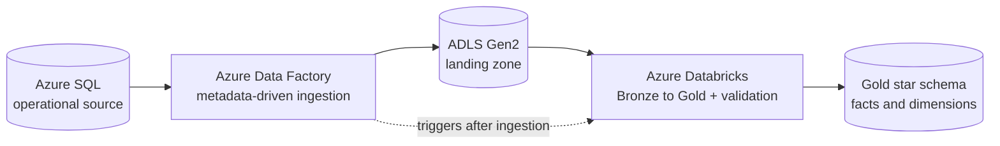
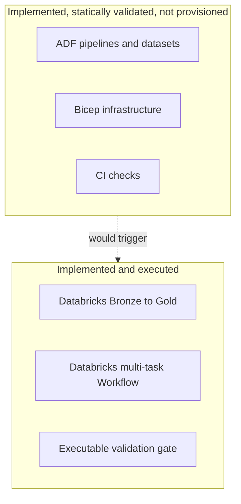

# Azure target architecture

This document describes the Azure-ready target for the retail lakehouse. The
Databricks transformation and orchestration core is implemented and has been
executed; the Azure ingestion and infrastructure assets are implemented as
deployment-oriented configuration with static validation enforced in CI. They
have not been provisioned (no Azure subscription is attached to this project).

## System context

## Data flow

1. **Source.** An operational relational source (modelled here as Azure SQL)
   holds the six entities: `customers`, `products`, `warehouses`, `orders`,
   `order_items`, `inventory_events`.
2. **Ingestion.** ADF reads active rows from `control.ingestion_metadata` and,
   per entity, performs a full or watermark-based incremental copy into ADLS
   Gen2 as Parquet, partitioned by entity and load date.
3. **Transformation.** The existing Databricks Job runs Bronze → Silver → Gold
   → validation, reading from the ADLS landing zone instead of the managed
   Volume used during local development.
4. **Serving.** Gold exposes dimensional models — including a Type 2 customer
   dimension and point-in-time sales fact — plus an inventory-movement fact.

## Azure service responsibilities

| Service | Responsibility |
|---|---|
| Azure SQL | Operational source of record for the six entities |
| Azure Data Factory | Metadata-driven ingestion, watermark management, orchestration |
| ADLS Gen2 | Landing zone for raw Parquet, partitioned by entity and load date |
| Azure Databricks | Bronze→Silver→Gold transformation, SCD2, validation gate |
| Databricks Workflow | Multi-task DAG with dependencies, retries, validation gating |

## Execution boundary

The Databricks core runs today against generated data landed in a managed
Volume. The Azure layer is the deployment target that would feed it from a real
source through ADLS. The demo and Azure targets use separate Bronze loaders and
validation tasks; the Silver and Gold transformation core is reused unchanged.

## Identity and secret flow

- ADF authenticates to Azure SQL, ADLS Gen2 and Azure Databricks with its
  **system-assigned managed identity**. No connection strings or tokens are
  stored in the linked services.
- The ADF identity is granted **Storage Blob Data Contributor** on the storage
  account (see `azure/bicep/modules/data_factory.bicep`).
- Databricks reaches ADLS through an **Access Connector** managed identity,
  granted the same role (`azure/bicep/modules/databricks.bicep`), for use as a
  Unity Catalog storage credential.
- All workspace URLs, job IDs, server names and account names are **parameters**,
  supplied at deploy time — none are committed.

## Failure handling

- **Ingestion:** each entity's watermark is advanced only after its copy
  succeeds: `UpdateWatermark` runs only inside `AdvanceWatermarkIfPresent`, which
  depends on `CopyIncremental` = `Succeeded` and fires only when the high
  watermark is non-null. A failed copy leaves the stored watermark untouched, so
  the next run retries the same range rather than skipping data. Full-load
  entities take the `CopyFull` branch and never touch the watermark.
- **Orchestration:** the Databricks job runs only after ingestion succeeds
  (`RunDatabricksLakehouseJob` depends on `RunMetadataIngestion` = `Succeeded`).
- **Transformation:** the Databricks Workflow propagates upstream failure —
  a failed task blocks its dependents — and ends in a validation task that
  raises on any failed check, failing the run rather than publishing bad data.

## Full versus incremental loads

Load types are chosen from the real source columns, not assumed:

| Entity | Load type | Watermark | Reason |
|---|---|---|---|
| `customers` | incremental | `updated_at` | changes over time; feeds SCD2 |
| `products` | incremental | `updated_at` | catalog carries a change timestamp |
| `warehouses` | full | — | small reference table, no change timestamp |
| `orders` | incremental | `order_timestamp` | append-oriented, monotonic at insert |
| `order_items` | full | — | source has no change/insert timestamp yet |
| `inventory_events` | incremental | `event_timestamp` | append-only event stream |

`order_items` is loaded in full deliberately: the current source contract has no
change or insert timestamp, so it cannot be loaded incrementally without one.
The target Azure source contract should add such a column to enable incremental
loading; this is recorded in the ingestion metadata rather than worked around
with an invented column.

## Databricks landing-path parameterization

The Databricks notebooks and Job accept a `landing_path` parameter:

- **Local / development:** a managed Unity Catalog Volume,
  `/Volumes/retail_lakehouse/bronze/landing_files/source`, so the pipeline runs
  with no external storage.
- **Azure target:** an ADLS Gen2 path,
  `abfss://landing@<storage-account>.dfs.core.windows.net/retail`, configured as
  the Azure Databricks Job's `landing_path` default during deployment.

The Silver and Gold notebooks are unchanged between the two targets; the Bronze
loader and the validation task differ, and the landing path is a parameter. That
is the seam between the implemented core and the Azure target.
